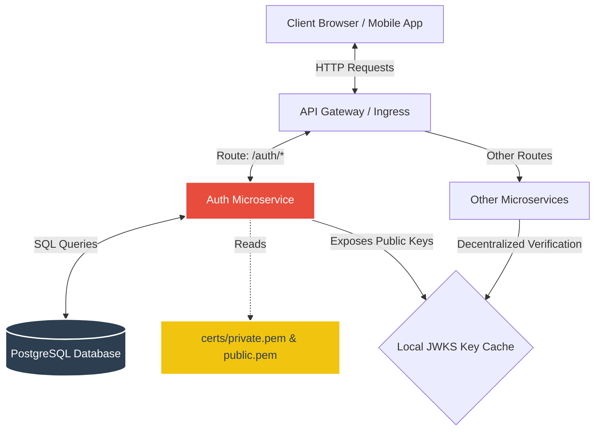
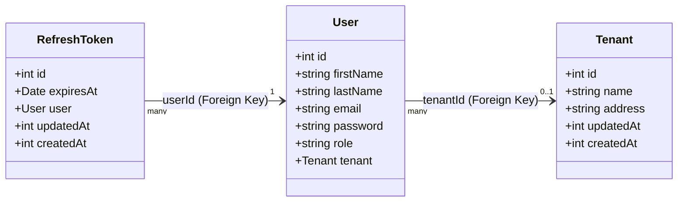
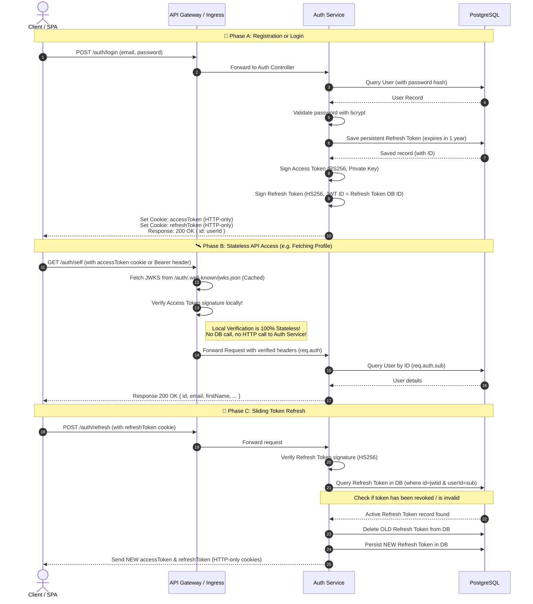

# 🍕 Authentication Microservice - Architecture & System Design

This document provides a comprehensive technical deep-dive into the architecture, security patterns, database schema, and operational mechanics of the **Authentication Microservice** for the Pizza Delivery Platform.

---

## 🧭 High-Level Summary

The **Authentication Microservice** is a secure, stateless user-identity and authorization management service. Built with **Node.js, Express, TypeScript, and TypeORM**, it connects to a **PostgreSQL** database. 

It implements a modern **multi-tenant dual-token asymmetric authentication architecture** designed for high security, decentralization, and scalability in a microservices ecosystem (e.g., Kubernetes).

### Key Architectural Highlights
*   **Asymmetric Access Tokens (`RS256`)**: Access tokens are signed using a secure 2048-bit **RSA Private Key** and verified asynchronously using the corresponding public key.
*   **Decentralized Token Verification (JWKS)**: Serves a public JSON Web Key Set (**JWKS**) endpoint at `/.well-known/jwks.json`. This enables API Gateways and other microservices to verify client identity locally without querying the Auth Service or the database.
*   **Persistent Sliding Sessions (`HS256`)**: Refresh tokens are signed symmetrically and registered in the database, allowing granular revocation and secure session renewals.
*   **First-Class Multi-Tenancy**: Built-in support for segregating users by tenants (e.g., specific restaurant franchises or stores), including tenant-specific roles (`admin`, `manager`, `customer`).

---

## 🗺️ System Architecture

The following diagram illustrates how the Authentication Service interacts with clients, database storage, and external components in the cluster.

---

## 🗄️ Database Design & Schema

The service uses **TypeORM** to manage its PostgreSQL schema. It consists of three primary tables: `users`, `tenants`, and `refreshTokens`.

### Table Specifications

#### 1. `tenants` (Multi-Tenancy partitioning)
*   `id`: `PrimaryGeneratedColumn` (Integer Serial)
*   `name`: `varchar(100)`
*   `address`: `varchar(255)`
*   `updatedAt` / `createdAt`: Automatic timestamps managed by TypeORM.

#### 2. `users` (Identity Records)
*   `id`: `PrimaryGeneratedColumn` (Integer Serial)
*   `firstName` / `lastName`: String columns containing user details.
*   `email`: Unique String column representing the login username.
*   `password`: Hashed string (`bcryptjs` with 10 rounds). **Hidden by default** in SELECT queries (`select: false` setting) to prevent accidental logging or exposure.
*   `role`: String representing RBAC capabilities. Permitted values: `"admin"`, `"manager"`, `"customer"` (defined in `Roles` constant).
*   `tenant`: `ManyToOne` relationship to `Tenant` (nullable, e.g., global system admins and general customers don't belong to a tenant, but franchise owners/managers do).

#### 3. `refreshTokens` (Session tracking)
*   `id`: `PrimaryGeneratedColumn` (Integer Serial)
*   `expiresAt`: Timestamp representing session expiration.
*   `user`: `ManyToOne` relationship to `User`, binding a token to a specific security principal. One user can log in from many devices.
*   `updatedAt` / `createdAt`: Automatic timestamps.

---

## 🔒 Security Architecture & Dual-Token Flow

The microservice implements a highly secure, hardened auth cycle that maximizes defense-in-depth:

### 1. The Token Pair Setup
| Attribute | Access Token | Refresh Token |
| :--- | :--- | :--- |
| **Signature Type** | Asymmetric (`RS256`) | Symmetric (`HS256`) |
| **Signing Key** | RSA Private Key (`certs/private.pem`) | Shared HMAC Secret (`REFRESH_TOKEN_SECRET`) |
| **Expiry Time** | Short-Lived (`1d`) | Long-Lived (`1y` / 365 days) |
| **Delivery Medium**| Cookie `accessToken` (HTTP-Only) / Authorization Bearer Header | Cookie `refreshToken` (HTTP-Only) |
| **Verification** | Verified instantly via Public JWKS (Zero Database Overhead) | Verified against Database storage (`refreshTokens` table) |

### 2. Detailed Authentication Sequence

---

## 🛠️ Step-by-Step Walkthrough of Core Modules

### 📦 Key Management (RSA ➡️ JWKS)
*   **Key Generation**: The `generateKeys.mjs` script leverages Node's `crypto` module to output a PKCS#1 PEM 2048-bit RSA pair inside `./certs/`.
*   **JWK Generation**: The `convertPemToJwk.mjs` script reads `./certs/public.pem` and utilizes `rsa-pem-to-jwk` to export the public key into JWK (JSON Web Key) format inside `public/.well-known/jwks.json`.
*   **Exposing the Keys**: The Express application mounts static routing `app.use(express.static("public"))` making the public JWKS file available on `http://localhost:PORT/.well-known/jwks.json`.

### 🛡️ Core Middlewares
1.  **`authenticate.ts`**:
    *   Uses `express-jwt` to validate `RS256` Access Tokens.
    *   Integrates `jwks-rsa` client which automatically fetches the public verification key from `Config.JWKS_URI` (with built-in caching and rate-limiting).
    *   Checks both the `Authorization: Bearer <token>` header and the `accessToken` HTTP-only cookie.
2.  **`canAccess.ts`**:
    *   A high-order route-guard middleware. Checks `req.auth.role` against a list of authorized roles. If the role is missing, it drops the request with a `403 Forbidden` error.
3.  **`validateRefreshToken.ts`**:
    *   Validates `HS256` Refresh Tokens.
    *   Employs an `isRevoked` callback checking the token's presence in the database. If a database record is deleted (e.g. on logout or refresh), `isRevoked` returns `true`, triggering a `401 Unauthorized` block.

---

## ⚠️ Pitfalls, Edge Cases & Operational Gotchas

> [!WARNING]
> ### Database Synchronization in Production
> In `src/config/data-source.ts`, the parameter `synchronize: true` is configured. This is suitable for development but **strictly forbidden in production**. Database synchronization automatically alters tables to match the entity definition, which can lead to accidental data loss. Always set `synchronize: false` in production and rely exclusively on migrations.

> [!IMPORTANT]
> ### Multi-Service JWT Verification Domain (Config.MAIN_DOMAIN)
> Cookies (`accessToken` and `refreshToken`) are scoped to `Config.MAIN_DOMAIN` in `AuthController.ts`. 
> *   **Local Dev**: In `.env.dev`, `MAIN_DOMAIN` is left undefined, which defaults cookies to `localhost`.
> *   **Production / Kubernetes**: You must configure `MAIN_DOMAIN` to your top-level domain (e.g., `pizza-platform.com`) so that the cookies are readable across subdomains (e.g., `api.pizza-platform.com`, `admin.pizza-platform.com`).

> [!NOTE]
> ### Security Key Rotation
> If your RSA private key is compromised, you can rotate the key safely:
> 1. Run `node scripts/generateKeys.mjs` to produce a new keypair.
> 2. Run `node scripts/convertPemToJwk.mjs > public/.well-known/jwks.json` to generate the new JWK and append it to the `keys` array in `jwks.json`. Keeping both the old and new public keys in the `keys` array allows existing logged-in users to remain authenticated until their current access tokens expire.
> 3. After 1 day (when all old access tokens have expired), remove the old public key from the `keys` array in `jwks.json`.

---

## 🚀 Suggested Next Steps

1.  **Switch to Multi-Key JWKS**: Currently `scripts/convertPemToJwk.mjs` outputs a single key. Enhancing it to append keys with unique `kid` (Key IDs) enables zero-downtime key rotation.
2.  **Add Token Blacklisting Cache**: Introduce a Redis layer to cache revoked refresh tokens, improving performance for `isRevoked` calls on session refresh.
3.  **Dockerization**: Review `docker/` configuration and deploy database migrations automatically inside the container startup sequence.
